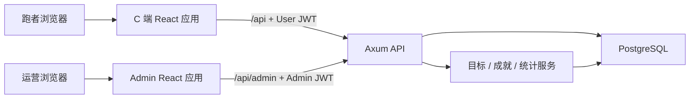

# RunGoal 系统架构

## 运行边界

- C 端和管理端是独立构建产物，认证令牌与签名密钥互相隔离。
- Axum 的 `AppState` 只承载数据库连接池和已校验配置；路由负责协议转换，统计与成就计算放在 service 层。
- PostgreSQL 是唯一持久化来源。SQLx 迁移在连接池建立后、HTTP 监听前执行，失败会让进程明确退出。

## 前端数据流

1. 路由页面通过动态 `import()` 按需加载，首屏不再包含统计图、分享卡片和其他业务页面。
2. API 实例统一添加 access token；多个请求同时收到 401 时只发起一次 refresh 请求，其余请求等待同一个结果。
3. 仅明确的认证失效会清理会话；普通网络抖动不会把用户强制登出。
4. 根级错误边界负责处理渲染异常，页面级加载、空态和失败态由页面自行表达。
5. 所有写入 `NaiveDateTime` 的时间按本地年月日时分秒序列化，避免用 UTC 字符串造成时区漂移。

## 服务端安全约束

- `APP_ENV=production` 时三个 JWT 密钥必须至少 32 位、互不相同且不是开发默认值。
- `CORS_ORIGINS` 使用明确来源列表，不允许通配符来源。
- 管理员仅在 Admin 表为空且显式提供 seed 用户名/密码时创建；不内置公开弱口令。
- 数据库错误记录到服务端日志，对客户端只返回通用错误消息。

## 数据模型

初始迁移维护 `User`、`Run`、`Goal`、`GoalRecord`、`UserAchievement`、`Challenge` 和 `Admin` 七张运行表，并为用户时间线、归档记录、活动目标与挑战状态建立索引。表名和 camelCase 列名保留现有 API/SQLx 约定，避免无收益的数据层重写。

## 当前运维注意事项

- 本地完整运行前必须有可访问的 PostgreSQL；前端可独立启动检查登录页与静态交互。
- 生产环境由 Nginx/OpenResty 终止 HTTPS。GPS 页面在非安全来源下无法获取定位。
- 初始管理员创建成功并完成首次登录后，应删除 `.env` 中的 `ADMIN_SEED_*` 配置。
